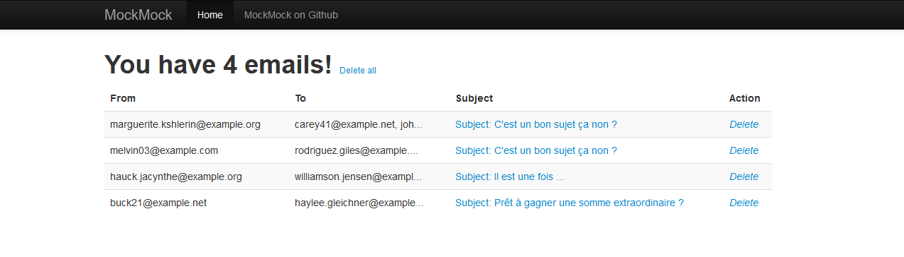
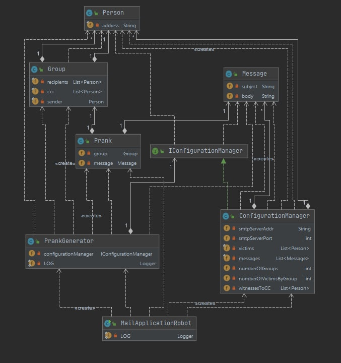
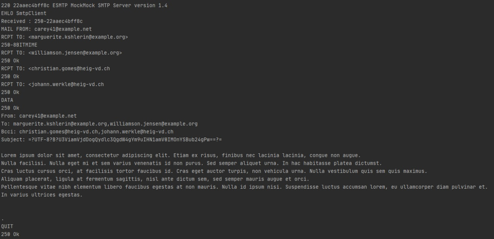

# Teaching-HEIGVD-RES-2021-Labo-SMTP

Authors : Christian Gomes & Johann Werkle

Date : 08.05.2021

## Description du projet

Ce projet consiste à développer une application client permettant de communiquer avec un serveur SMTP afin d'envoyer des plaisanteries.

Le but est de pouvoir définir un ou plusieurs groupe(s) de victimes (définies par leur adresse mail et choisies aléatoirement) à partir d'un fichier texte, de définir un message également à partir d'un fichier texte et d'envoyer à chaque groupe une plaisanterie après s'être connecté au serveur SMTP.

## Configuration de l'application

Un utilisateur peut définir les paramètres de l'application à l'intérieur des fichiers de configuration **configuration.properties** définit comme tel :

```properties
smtpServerPort=25 //Port du serveur SMTP
stmpServerAddress=localhost	// Addresse du serveur SMTP
numberOfGroups=4 // Nombre de groupes à générer
numberOfPeopleByGroup=3 // Nombre de personnes par groupe
witnessestoCC=christian.gomes@heig-vd.ch;johann.werkle@heig-vd.ch // Addresses en copie (cachée)
```

Une liste des victimes est accessible et modifiable dans le fichier **victims.utf8**. Elle est actuellement définie comme telle : 

```
christian.gomes@heig-vd.ch
johann.werkle@heig-vd.ch
buck21@example.net
melvin03@example.com
rodriguez.giles@example.net
tkeebler@example.com
hauck.jacynthe@example.org
xgaylord@example.com
marguerite.kshlerin@example.org
carey41@example.net
williamson.jensen@example.org
haylee.gleichner@example.com
```

Une liste de messages est également accessible et modifiable par l'utilisateur et se trouve dans le fichier **messages.utf8**, définit comme tel : 

```
Subject: subject // sujet du mail

Text // Body du mail

==
Subject: subject // sujet du mail

Text // Body du mail

==
```


L'application peut être lancée depuis la source du projet avec un `mvn clean install`.

## Serveur SMTP

En parallèle de l'application, il peut être intéressant de lancer un serveur SMTP de test afin de valider le bon fonctionnement de la configuration avant d'envoyer les mail. Pour cela, un serveur dit "Mock" peut être utilisé. Pour fonctionner, le serveur doit être configuré comme tel:

Adresse du serveur : localhost

Port du serveur : 25

Un serveur Mock est fourni avec l'application et s'exécute dans un conteneur Docker qui se trouve à la racine du projet. Le lancement peut être effectué depuis un terminal comme tel : 

```
cd docker
./build-image.sh
./run-container.sh
```

Dès que le docker est lancé , nous avons accès via le navigateur à l'adresse http://localhost:8282/ qui nous permet d'avoir un affichage sur les mails. 



### Lancement du serveur sans docker

Il est possible de lancer le serveur MockMock sans docker , pour cela il faut aller sur le repo https://github.com/tweakers/MockMock et télécharger le jar fourni. 

Pour le démarrer il faut éxecuter la commande : 

```-
java -jar MockMock.jar (par défaut port 25 pour stmp et port 8282 , the web interface)

ou 

java -jar MockMock.jar -p 25000 -h 8080 (si l'on souhaite spécifier des ports)
```

## Description of implémentation

Voici un schéma URL au terme de l'implémentation du projet: 



Comme déjà commenté plus haut, la classe `Person` est définie par une adresse mail.

La classe `Group` contient une liste de `Person` pour les destinataires d'un mail, une liste de Person pour les témoins et enfin un sender qui contient une adresse d'envoi utilisée pour masquer l'adresse du véritable envoyeur.

La classe `Message` contient le texte du sujet et du body du mail.

La classe `Prank` contient un groupe et un message et permettra ainsi de récupérer tout le nécessaire pour générer un email.

La classe `ConfigurationManager` permet d'instancier toutes les informations nécessaires à la création des ressources et à la connexion à un serveur.

La classe `PrankGenerator` permet de générer une liste de `Prank`.

La classe `SmtpClient` qui n'est pas dans le schéma permet d'établir la connexion et de générer une communication entre le client et un serveur SMTP.


Ci-dessous un exemple de dialogue entre notre client et un serveur Mock SMTP lors d'un envoi d'un prank : 

